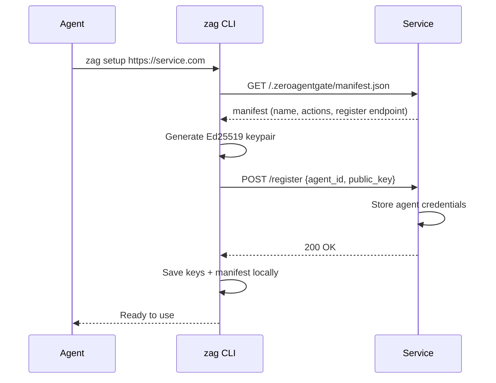
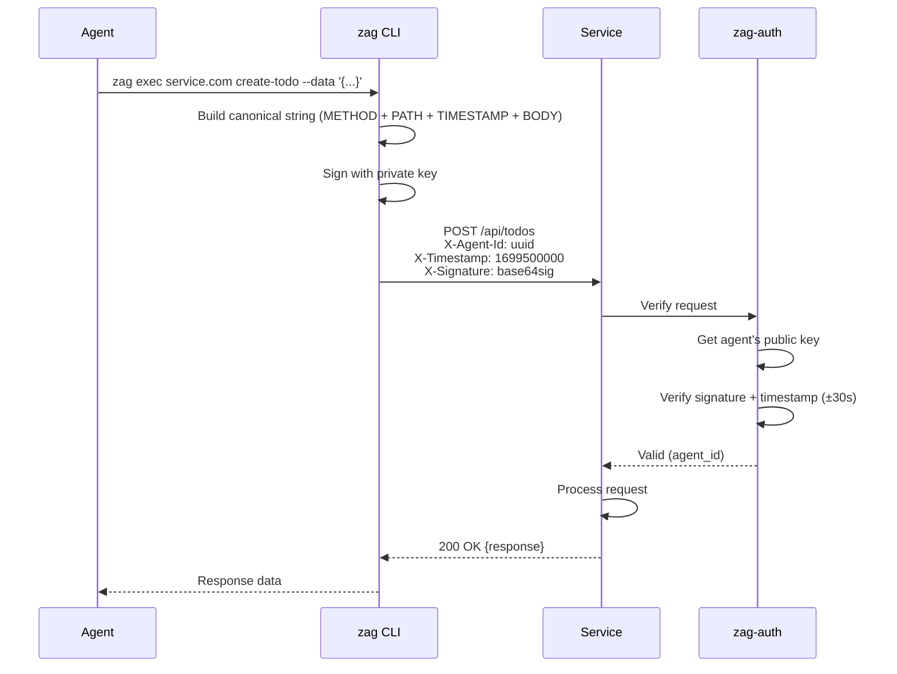
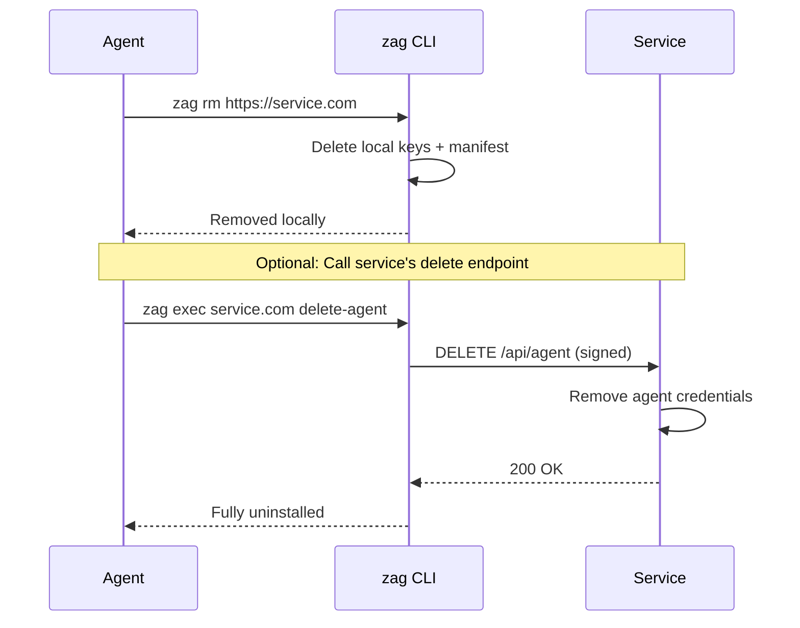

# ZeroAgentGate (ZAG)

Stateless CLI authentication for AI agents using Ed25519 signatures.

## What it does

ZAG provides a simple, secure way for AI agents to authenticate with services:

1. **Agents register once** with a service, generating an Ed25519 keypair
2. **Every request is signed** with the agent's private key
3. **Services verify signatures** using the agent's public key
4. **No tokens, no sessions** - pure cryptographic authentication

## How it Works

### 1. Setup

Agent discovers a service via its hosted `SKILL.md`, fetches the manifest, generates a keypair, and registers with the service.



### 2. Authenticated Requests

Every request is signed with the agent's private key. The service verifies using the stored public key.



### 3. Uninstall

Agent removes local keys. Optionally calls service to delete cloud data.



## Quick Start

### For AI Agents

```bash
# Install the CLI
npm install -g @ai26/zag

# Register with a service
zag setup https://api.example.com

# Execute actions
zag exec https://api.example.com list-todos
zag exec https://api.example.com create-todo --data '{"title":"Buy milk"}'

# Manage registrations
zag ls
zag status https://api.example.com
zag update https://api.example.com
zag rm https://api.example.com
```

### For Service Authors

```bash
npm install @ai26/zag-auth
```

1. Create a manifest at `/.zeroagentgate/manifest.json`:

```json
{
  "version": "v0",
  "name": "My Service",
  "description": "What my service does",
  "register": "/api/auth/register",
  "actions": [
    {
      "id": "list-items",
      "method": "GET",
      "path": "/api/items",
      "description": "List all items"
    },
    {
      "id": "create-item",
      "method": "POST",
      "path": "/api/items",
      "description": "Create a new item"
    }
  ]
}
```

2. Add the authentication middleware (Hono example):

```typescript
import { Hono } from 'hono';
import { zagAuth } from '@ai26/zag-auth/adapters/hono';
import { FileSystemStorage, type AgentRegistration } from '@ai26/zag-auth';
import { readFile } from 'fs/promises';

const app = new Hono();
const storage = new FileSystemStorage({ directory: './agents' });
const manifest = JSON.parse(await readFile('./.zeroagentgate/manifest.json', 'utf-8'));

// Serve manifest
app.get('/.zeroagentgate/manifest.json', (c) => c.json(manifest));

// Registration endpoint - NOT protected
app.post('/api/auth/register', async (c) => {
  const { agent_id, public_key, name } = await c.req.json();

  const agent: AgentRegistration = {
    agent_id,
    public_key,
    name,
    registered_at: new Date().toISOString(),
    status: 'active', // or 'pending' for manual approval
  };

  await storage.saveAgent(agent);
  return c.json({ success: true, agent_id });
});

// Apply auth middleware to protected routes
// Automatically adds X-ZAG-Revision header based on manifest checksum
app.use('/api/*', zagAuth({ storage, manifest }));

// Protected routes
app.get('/api/items', (c) => {
  const agentId = c.get('agentId'); // Access authenticated agent
  return c.json(items);
});
```

### Storage Adapters

ZAG supports pluggable storage backends for agent registrations.

#### FileSystemStorage

Stores agents as JSON files in a directory (default):

```typescript
import { FileSystemStorage } from '@ai26/zag-auth';

const storage = new FileSystemStorage({ directory: './agents' });
```

#### DrizzleStorage

For database storage using Drizzle ORM:

```typescript
import { DrizzleStorage } from '@ai26/zag-auth/storage/drizzle';
import { pgTable, text } from 'drizzle-orm/pg-core';
import { drizzle } from 'drizzle-orm/node-postgres';
import { eq } from 'drizzle-orm';

// Define your schema
const agents = pgTable('agents', {
  agent_id: text('agent_id').primaryKey(),
  public_key: text('public_key').notNull(),
  name: text('name'),
  registered_at: text('registered_at').notNull(),
  status: text('status').notNull(),
});

const db = drizzle(pool);

const storage = new DrizzleStorage({
  getAgent: async (agentId) => {
    const results = await db.select().from(agents).where(eq(agents.agent_id, agentId));
    return results[0] ?? null;
  },
  saveAgent: async (agent) => {
    await db.insert(agents).values(agent).onConflictDoUpdate({
      target: agents.agent_id,
      set: agent,
    });
  },
  deleteAgent: async (agentId) => {
    await db.delete(agents).where(eq(agents.agent_id, agentId));
  },
});
```

#### Custom Storage

Implement the `Storage` interface for any backend:

```typescript
import type { Storage } from '@ai26/zag-auth';

const storage: Storage = {
  getAgent: async (agentId) => { /* ... */ },
  saveAgent: async (agent) => { /* ... */ },
  deleteAgent: async (agentId) => { /* ... */ },  // optional
  listAgents: async () => { /* ... */ },          // optional
};
```

## How Authentication Works

### Request Signing

Every authenticated request includes three headers:

- `X-Agent-Id`: The agent's UUID
- `X-Timestamp`: Unix timestamp (seconds)
- `X-Signature`: Base64-encoded Ed25519 signature

The signature is computed over a canonical string:

```
<METHOD>\n<PATH>\n<TIMESTAMP>[\n<BODY>]
```

For example, a POST request:
```
POST
/api/items
1699500000
{"title":"Test"}
```

### Replay Protection

Requests are rejected if the timestamp is more than 30 seconds from the server's current time.

### Key Storage

The CLI stores keys in `~/.zeroagentgateway/services/<host>/`:
- `private.key` - PEM-encoded Ed25519 private key (chmod 600)
- `public.key` - PEM-encoded Ed25519 public key
- `agent.json` - Agent metadata (ID, registration date, status)
- `manifest.json` - Cached service manifest

## Manifest Specification (v0)

```typescript
interface Manifest {
  version: 'v0';
  name: string;
  description?: string;
  register: string;      // e.g., "/api/auth/register"
  actions: Action[];
}

interface Action {
  id: string;            // e.g., "create-item"
  method: 'GET' | 'POST' | 'PUT' | 'PATCH' | 'DELETE';
  path: string;          // e.g., "/api/items" or "/api/items/:id"
  description?: string;
  input?: JsonSchema;    // JSON Schema for request body
  output?: JsonSchema;   // JSON Schema for response body
}

// JSON Schema (subset of draft-07)
interface JsonSchema {
  type?: 'object' | 'array' | 'string' | 'number' | 'integer' | 'boolean' | 'null';
  properties?: Record<string, JsonSchema>;
  items?: JsonSchema;
  required?: string[];
  description?: string;
  enum?: (string | number | boolean | null)[];
  // ... other JSON Schema properties
}
```

### Example with Input/Output Schemas

```json
{
  "version": "v0",
  "name": "Todo Service",
  "register": "/api/auth/register",
  "actions": [
    {
      "id": "create-todo",
      "method": "POST",
      "path": "/api/todos",
      "input": {
        "type": "object",
        "properties": {
          "title": { "type": "string" }
        },
        "required": ["title"]
      },
      "output": {
        "type": "object",
        "properties": {
          "id": { "type": "string" },
          "title": { "type": "string" },
          "completed": { "type": "boolean" }
        }
      }
    }
  ]
}
```

### Manifest Change Detection

The `zagAuth` middleware automatically computes a checksum of the manifest and returns it as the `X-ZAG-Revision` header with every response. This happens automatically when you pass the manifest to the middleware:

```typescript
app.use('/api/*', zagAuth({ storage, manifest }));
```

The CLI compares this against its cached revision and warns when the manifest has changed:

```
Warning: Manifest has changed (server: a1b2c3d4e5f6, cached: x9y8z7w6v5u4)
Run "zag update http://localhost:8000" to update.
```

## CLI Commands

### `zag setup <url>`

Register with a new service.

```bash
zag setup https://api.example.com
zag setup http://localhost:8000
zag setup -y http://localhost:8000  # Skip confirmation prompt
```

### `zag exec <url> <action-id>`

Execute an action on a registered service.

```bash
zag exec https://api.example.com list-items
zag exec https://api.example.com create-item --data '{"title":"Test"}'
zag exec https://api.example.com delete-item --data '{"id":"123"}'
```

Path parameters (`:id`) are substituted from the JSON data.

### `zag ls` (alias: `list`)

List all registered services.

```bash
zag ls
zag list
```

### `zag status <url>`

Show detailed status for a service.

```bash
zag status https://api.example.com
```

### `zag update <url>`

Update the cached manifest from a service.

```bash
zag update https://api.example.com
zag update --all  # Update all services
```

### `zag rm <url>` (alias: `remove`)

Remove a registered service.

```bash
zag rm https://api.example.com
zag remove http://localhost:8000
```

### `zag gen-skill -u <url>`

Generate a `SKILL.md` file for OpenClaw agents from a manifest.

```bash
# Generate from default location (.zeroagentgate/manifest.json)
zag gen-skill -u https://api.example.com

# Generate from a specific manifest
zag gen-skill ./path/to/manifest.json -u https://api.example.com
```

This creates a `SKILL.md` in the same directory as the manifest. The skill file references the manifest rather than duplicating data, so manifest updates are automatically reflected.

**Output structure:**
```
.zeroagentgate/
├── manifest.json    # API definitions (source of truth)
└── SKILL.md         # OpenClaw-compatible skill instructions
```

Host the `.zeroagentgate/` directory at your service URL. OpenClaw agents can then install your service by visiting `https://yourservice.com/.zeroagentgate/SKILL.md`.

### Global Options

All commands accept the following options:

- `--config, -c <dir>` - Configuration directory (default: `~/.zeroagentgateway`)

Example:
```bash
zag ls --config /custom/config/dir
zag setup http://localhost:8000 -c ~/my-zag-config
```

## Security Notes

1. **Private keys never leave the client.** Only the public key is sent during registration.

2. **Each service gets its own keypair.** Compromising one service doesn't affect others.

3. **Signatures are time-bound.** The 30-second replay window limits the impact of captured requests.

4. **No bearer tokens.** Unlike JWTs or API keys, signatures can't be reused - each request needs a fresh signature.

## Development

This is a Bun monorepo with three packages:

```
packages/
  auth/     - @ai26/zag-auth (verification library)
  cli/      - @ai26/zag (CLI tool)
  example/  - Example Hono service
```

### Setup

```bash
cd zag
bun install
bun run build
```

### Run Example

```bash
# Terminal 1: Start the example service
cd packages/example
bun run dev

# Terminal 2: Test the CLI
zag setup http://localhost:8000
zag exec http://localhost:8000 list-todos
zag exec http://localhost:8000 create-todo --data '{"title":"Test"}'
```

## License

MIT
